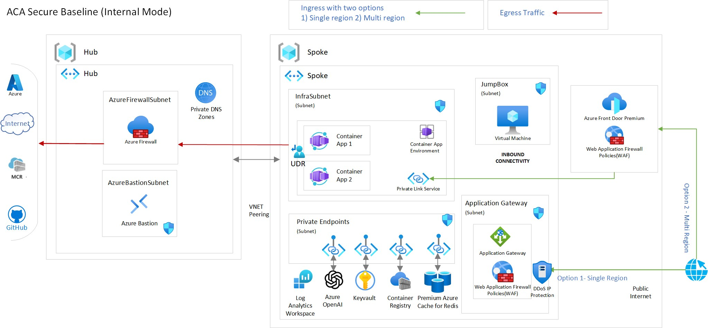

# Scenario 3: Azure Container Apps - Internal environment with App Config, Azure PostgreSQL, and Azure Storage

This reference implementation is based on the *secure baseline infrastructure architecture* from Scenario 1, and adds the following Azure services to the deployment:

- [Azure App Configuration](https://learn.microsoft.com/azure/azure-app-configuration/overview)
- [Azure PostgreSQL](https://learn.microsoft.com/azure/postgresql/overview)
- [Azure Storage](https://learn.microsoft.com/azure/storage/common-storage-services)

This scenario does not deploy Azure Container Registry as the sample application comes from a public GitHub repository. However, you can easily add Azure Container Registry to the deployment by following switching the param `deployAcr` to `true`.

By the end of this deployment guide, you would have deployed an "internal environment" Azure Container Apps cluster with the additional services referenced above.

## Core architecture components

- Azure Container Apps
- Azure Virtual Networks (hub-spoke)
- Azure Bastion
- Azure Firewall
- Route Table (User defined routing)
- Azure Application Gateway (with Web Application Firewall)
- Azure Standard Public IP (Optional: with [DDoS protection](https://learn.microsoft.com/azure/ddos-protection/ddos-protection-sku-comparison#skus))
- Azure Key Vault
- Azure Private Endpoint
- Azure Private DNS Zones
- Log Analytics Workspace
- Azure App Configuration
- Azure PostgreSQL
- Azure Storage
- Azure Policy (both built-in and custom)

## Diagnostic settings

All resources have enabled their Diagnostics Settings (by default sending the logs to a Log Analytics Workspace).

## Zone Redundancy

All the resources that support Zone Redundancy (i.e. Container Apps Environment, Application Gateway, Standard IP) are set by default to be deployed in all Availability Zones. If you are planning to deploy to a region that is not supporting Availability Zones you need to set the  parameter  `deployZoneRedundantResources` to `false`.

**TODO:**

- Add availability zone support if available for the new services (App Config, Azure PostgreSQL, Azure Storage)

## SKUs

This scenario tries to use the cheapest SKU available for each service. However, some features are only available on the higher tiers SKUs.
For example VNET Integration or Private Link/Endpoint support.

However, for enterprise usage we recommend a careful examination of all the services used and their limitations.

- Azure Container Apps - **Consumption**
- Azure Bastion - **Developer (Needs manual setup)**
- Azure Firewall - **Basic**
- Azure Application Gateway (with Web Application Firewall) - **WAF_v2**
- Azure Public IP - **Standard (DDoS protection disabled but optional)**
- Azure Key Vault - **Standard**
- Azure App Configuration - **Standard (for Private Link support)**
- Azure PostgreSQL - **Burstable B1ms compute, 32 GiB storage P4 (120 iops)**
- Azure Storage - **Standard, LRS**

## Azure Policy

Azure policies related to Azure Container Apps (both built-in but some custom as well) are applied to the spoke Resource Group by default. If you wish to skip Azure Policy Assignment, set the parameter `deployAzurePolicies` to `false`.

## Deploy the reference implementation

This reference implementation is provided with the following infrastructure as code options. Select the deployment guide you are interested in. They both deploy the same implementation.

:arrow_forward: [Bicep-based deployment guide](./bicep)
